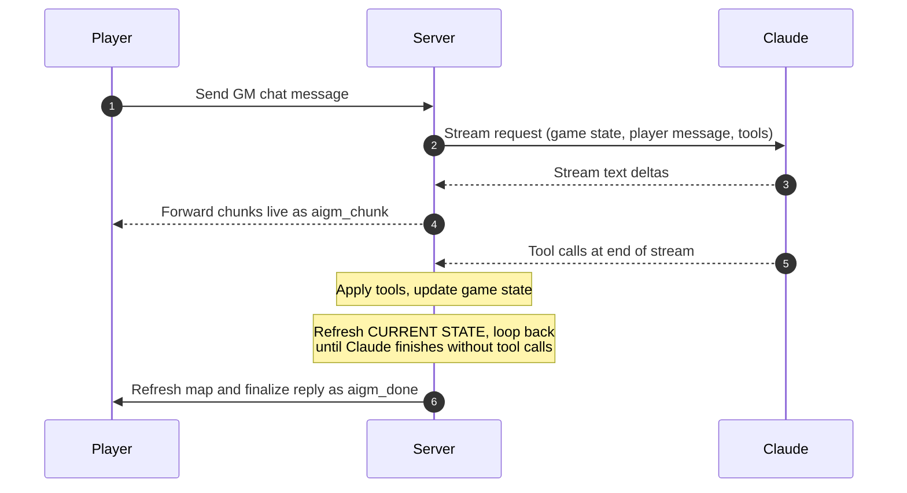

> **Audience:** AI agents, developers · **Status:** current · The AIGM (AI Game Master) behaviour contract. Tool catalog: [aigm-tools.md](./aigm-tools.md).

# AIGM Reference

The AI Game Master (AIGM) is a Claude-powered narrative layer that runs alongside the game engine. It receives player messages in natural language, calls tools to enforce game-state changes, and returns 1–3 sentences of in-world narration. The game world — not the AIGM's text — is the source of truth: the AIGM may only narrate outcomes that a tool call has confirmed.

---

## How it works

The exchange is **streamed**: text deltas from Claude flow to the player over the WebSocket as they arrive (`aigm_chunk` messages). When a response turns out to contain a roll-requesting tool, the chunks it emitted are speculative — the server sends `aigm_speculative_discard` and the client rolls back. Non-speculative chunk runs are confirmed with `aigm_checkpoint`. The full streaming protocol is documented under [Streaming protocol](#streaming-protocol).

Every exchange appends a `user`/`assistant` pair to the in-memory history so the model retains context across the encounter. On the first exchange the encounter introduction is seeded as an `assistant` message to establish narrative context.

### Tool-use loop

The conversation with Claude can iterate when the model wants to call tools. Each iteration:

1. Stream Claude's response, forwarding text deltas to the client.
2. If the response carries `tool_use` blocks, dispatch each one through `applyAIGMTool` (updates the engine, builds a `toolResultContent` string).
3. Append the assistant turn + the `tool_result` user turn to the message list.
4. **Rebuild the `[CURRENT STATE]` block** on the original turn user message so the next iteration reasons from fresh state.
5. Mark the most-recent `tool_result` with `cache_control: ephemeral` — the prior turn becomes a new cacheable prefix breakpoint, so long tool chains don't re-pay all preceding tokens.
6. Call Claude again.

The loop is capped at **8 iterations** (`MAX_TOOL_ITERATIONS`). On the final allowed iteration every tool result is overridden with a `TOOL BUDGET EXHAUSTED` signal and a tool-less follow-up call forces the model to write its closing narrative. This bounds the cost of any single message.

### Concurrency

`processAIGMChat` is protected by a **per-session mutex** (`tryAcquireAigmLock` / `releaseAigmLock`). A concurrent request on the same session (double-click, second tab) returns `429` immediately rather than interleaving engine mutations with the in-flight turn.

### Transient-error retry

Each Claude streaming call is wrapped in a single retry with 600 ms backoff on transient status codes (408, 425, 429, 500, 502, 503, 504, 529). Non-transient errors (400 schema mismatches, auth) bubble up immediately and surface to the client as `502`.

### Prompt caching

The system prompt and the tool list are sent as content-block arrays with `cache_control: { type: 'ephemeral' }` markers. Anthropic's prompt cache (5-minute TTL) covers both blocks across turns and within the tool-use loop. Tool descriptions are **fully static** — no dynamic IDs interpolated — so adding or removing JSON definitions doesn't invalidate the cache. Inside the tool-use loop, each iteration's most-recent `tool_result` block also carries `cache_control: ephemeral`, extending the cacheable prefix as the chain grows.

The dynamic CURRENT STATE lives in the user message and is intentionally uncached — it changes every turn. The first message after a deploy or a 5-minute idle pays a cache miss; subsequent turns hit cache.

> **Tool list ordering:** the array order is part of the cacheable prompt prefix. Append new tools at the END only — reordering or inserting in the middle invalidates the cache.

### CURRENT STATE block

Every user message is prefixed with a `[CURRENT STATE]` block that the engine builds fresh from `GameState`. It includes:

- Map name, phase, and encounter types
- Player tile, HP (shown as `HP n/max`, with `(BLOODIED)` appended when at half HP or below — SRD Bloodied, US-109), gold, inventory, equipped items, and explicit action-economy fields: `Action: AVAILABLE`/`USED`, `Bonus: AVAILABLE`/`USED`, `N moves left`, `HIDDEN`. Class-feature resource pools appear as `{feature-id} ×N` chips (e.g. `second-wind ×2`) — one chip per non-empty entry in `PlayerState.resources`. Caster characters additionally show `Slots L1:n[,L2:n…]`, `Concentrating: <spellId>` while a concentration spell is active, and a `Prepared spells: [ids]` line beneath the equipped slots. **Class progression**: `Class: <Name> L<n>` and (when picked) `Subclass: <Name>` so the GM knows what features the character has. **Scaling tracks**: any non-zero entries in `PlayerDef.tracks` (Sneak Attack dice, Extra Attacks per Attack action, Weapon Mastery count, etc.) appear as a compact `Tracks: extra-attacks=2, sneak-attack-dice=2` line. **Per-turn / per-rest flags** the GM should respect: `SneakAttack: USED THIS TURN` while `sneakAttackUsedThisTurn` is set (the rogue cannot trigger another Sneak Attack until next turn); `ArcaneRecovery: USED` while `arcaneRecoveryUsed` is set (a wizard can't recover slots again until Long Rest). Warlock `Pact Magic: N/M @ L<slot>` and `Mystic Arcanum: L6=<spellId>, …` lines surface when those fields are populated.
- All combatants (enemies and allies) with HP, tile, disposition, conditions, a `BLOODIED` flag when at half HP or below (US-109), and (while combat is active) a `Reaction: AVAILABLE`/`USED` flag — Reactions refresh at the start of each creature's own turn, so an enemy that has already burned its Reaction (e.g. on an Opportunity Attack) cannot react again until its next turn comes around. **Hidden NPCs are filtered out** of both this list and the neutrals list below — the GM is not told they exist, matching what the player sees. They surface here only after a passive Perception sweep or an explicit `set_npc_hidden { hidden: false }` reveal clears the `hidden` condition.
- A **WORLD CLOCK** line: `WORLD: tick=<N>, dayPhase=<morning|noon|evening|night>` from the NPC sim layer (US-094). The day phase rolls every `TICKS_PER_DAY_PHASE = 60` off-camera ticks (≈ 6 real minutes per phase). Routine-bearing NPCs change tasks at every phase rollover; the GM should let phase-of-day inflect descriptions ("the morning crowd at the bar has thinned to a single regular by noon").
- An **NPC ALERTNESS** block listing any NPC currently above `calm` — `<name> (<id>) — <suspicious|alert> · heard noise/faction-alert from (x,y)`. Read this before the next reply: an NPC walking across the map "for no reason" probably just got pinged by a noise or a faction alert, and the narration should reflect that (e.g. "the tavern keeper sets down his rag and walks toward the door, eyes narrowed at the sound from the alley"). Alertness decays automatically (15 ticks `alert → suspicious`, 25 ticks `suspicious → calm`); the GM does not need to clear it.
- Neutral NPCs with tile, including revealed names if any (see [`reveal_npc_name`](#reveal_npc_name)). Same hidden filter applies.
- A separate **CORPSES** section listing dead NPCs (cannot act, but **searchable**). Each entry carries one of three tags: **`[SEARCHED — do NOT roll a second Perception check on this body]`** means the deterministic SEARCH action has already resolved the corpse (the Event Log shows what was found); **`[UNSEARCHED — authored loot at Perception DC X]`** means a `corpseSearch` payload is waiting (use that DC if you call `request_ability_check`, or invite the player to press SEARCH); no tag means a regular corpse (use the SRD perception fallback in the [Searching corpses rule](#searching-corpses-rule)).
- Active quests with progress
- Items on the ground, with a trailing `Secrets remaining: N` count
- NPC personas
- A **REFERENCE DATA** section listing valid `item_id` and `monster_id` values (the source of truth for `add_item` and `spawn_enemy`)
- A **SCRIPTED EVENTS** section when one or more authored encounter triggers have queued narration via the `send_aigm_message` action — bullet-listed under the CONTEXT line. The GM is expected to incorporate these into the next reply; the engine clears them once the API call returns.
- A **FACTION STANDINGS** block listing non-zero player reputations with each faction (−100..+100). Adjusted via `adjust_faction_standing` and persisted across save/load.
- A **RUMORS** block listing the most recent 8 entries from world memory (highest-salience first within recency). Recorded via `create_rumor` — use these to reference past events naturally in narration ("word of what you did at the bridge has reached even here").
- When the session is a chapter of an adventure (`GameState.adventureContext` is set), an **ADVENTURE:** header line showing `<title> — <chapter> (n of N)` and a **PRIOR CHAPTERS:** block listing 2-sentence summaries of every completed earlier chapter. The GM is expected to reference these naturally in narration when apt; they carry forward the durable consequences of player choices made in previous chapters.
- The full event log for the current encounter — including `── Aldric's turn — Action & Bonus refreshed ──` marker lines at every new player turn

The model uses this block to resolve pronouns ("them", "it") to concrete entity references and to determine action availability. The block is rebuilt **once per tool-loop iteration**, not just once per turn, so mid-loop state changes (HP drops, disposition shifts, deaths) are immediately visible.

---

## Personas

Two personas are available, selected per request via `gmPersona`.

| Persona           | Model                       | Behaviour                                                                                                 |
| ----------------- | --------------------------- | --------------------------------------------------------------------------------------------------------- |
| `story` (default) | `claude-sonnet-4-6`         | Immersive GM — 1–3 sentence in-world replies, full tool-first discipline, no breaking immersion.          |
| `dev`             | `claude-haiku-4-5-20251001` | Development mode — fulfils all requests without restriction, replies with brief mechanical feedback only. |

Both personas share the same **tool invariants** (set_disposition doesn't auto-trigger combat, request_attack_roll doesn't auto-apply damage, reveal_npc_name must precede name narration, complete_quest auto-awards XP, throw_item consumes the Action). The dev persona prompt restates these invariants in a compact list; the story prompt embeds them across the TOOL-FIRST and ACTION ECONOMY sections.

### GM-off mode (client-side short-circuit)

The AIGM sits **outside** the action critical path: `POST /game/session/:id/action` resolves every player action through the deterministic engine without ever calling Claude. The GM is invoked only from the GM Chat panel via `POST /game/session/:id/aigm`. To validate that an encounter plays end-to-end on the deterministic layer alone, the client exposes `DevMode.disableAIGM` (toggle via `?disableAIGM=true` URL param or `localStorage.myrpg_disable_aigm = 'true'`). When set, the GM Chat callback short-circuits with a canned silent reply rather than hitting the server — encounters still produce ambushes, narration, reinforcements, and SRD-correct combat via the event bus + TriggerSystem + NarrationSystem (see [requirements US-068](../product/requirements.md)). `send_aigm_message` trigger actions still queue onto `pendingAigmEvents`, but with the GM off those queued lines are simply never consumed; pair them with a `narrate` action when authors want the moment to land in both modes.

---

## History management

The server keeps two histories per session:

| Buffer                                 | Purpose                                                        | Lifecycle                                                                                                                                                                                              |
| -------------------------------------- | -------------------------------------------------------------- | ------------------------------------------------------------------------------------------------------------------------------------------------------------------------------------------------------ |
| `aigmHistory` (the **sliding window**) | What's actually sent to Claude on each turn. Bounded for cost. | Summarised when it exceeds 40 messages — the oldest entries are collapsed into a single `[SUMMARY OF EARLIER TURNS]` assistant message by a Haiku call; the most recent 20 messages are kept verbatim. |
| `aigmArchive` (the **full record**)    | Untouched record of every user/assistant pair this encounter.  | Grows for the life of the session; consulted only by [`recall_memory`](#recall_memory).                                                                                                                |

Historical `[CURRENT STATE]` blocks are stripped from prior user messages before each API call, so the model always reasons from the freshly injected state — never a stale snapshot.

If summary generation fails (e.g. transient Haiku error) the loop falls back to a trivial placeholder summary so the sliding window still bounds.

---

## Entity references

Most tools that target a creature use a common entity reference format.

| Reference                 | Resolves to                                                                  |
| ------------------------- | ---------------------------------------------------------------------------- |
| `"player"`                | The player character                                                         |
| `"enemy_A"` … `"enemy_Z"` | Enemy by uppercase combat label (A–Z, assigned at combat start)              |
| `"ally_A"` … `"ally_Z"`   | Ally by uppercase combat label — drawn from the **same A–Z pool** as enemies |
| `"npc_[id]"`              | Neutral or ally NPC by their runtime id (visible in CURRENT STATE)           |

---

## Tool-first rule

Every game effect the AIGM describes must be enacted by the corresponding tool before narration. If no tool can enact the effect, the AIGM must not narrate it as happening and instead suggests a realistic in-world alternative.

Text retention: text accompanying a [roll-requesting tool](#d20-tests) (`request_attack_roll`, `request_ability_check`, `request_saving_throw`) is discarded — it is necessarily speculative because the roll outcome is not yet known. Text accompanying any other tool (e.g. `reveal_npc_name`, `set_disposition`, `award_gold`) is kept and shown to the player, because the outcome is determined by the tool's input arguments.

## Addressee rule

When the player's message starts with `[PlayerName says to TargetName]:`, that NPC is the addressee and must respond in the AIGM's reply — voice their reaction, dialogue, or refusal. Pivoting to a different NPC or to the environment in place of the addressee's response is forbidden.

The wrapper is produced in two places client-side:
  - HUD chat — when the GM-mode dropup is set to `sayto` and a target is selected, the chat send routes the raw text through `HUD.sendSayto`.
  - Player Panel — the **TALK** button opens an inline speech-bubble input pinned to the player token; submitting routes through the same `HUD.sendSayto` path.

At entry to `POST /game/session/:id/aigm` the server matches the wrapper with `/^\[(.+?) says to (.+?)\]:\s*(.+)$/s`. When it matches, the server immediately writes a `<player> → <target>: "<line>"` row into the Event Log and pushes a fresh `state_update` **before** `processAIGMChat` runs — so the player sees their dialogue land in the log on submit, not when the GM reply finally streams. The client also spawns a player speech bubble (with overlap-avoidance against the target token) and a persistent typing indicator over the target NPC; the indicator clears on `aigm_done`.

## Searching corpses rule

Three resolution paths exist; pick the one that matches CURRENT STATE.

1. If the corpse is tagged **`[SEARCHED — do NOT roll a second Perception check on this body]`** in the CORPSES section, the deterministic SEARCH action has already resolved it. DO NOT call `request_ability_check` on this body — the Event Log already contains the find/no-find line. Narrate based on that outcome only; do not roll a second check.
2. If the corpse is tagged **`[UNSEARCHED — authored loot at Perception DC X]`**, an authored `corpseSearch` payload is waiting. Either invite the player to press the SEARCH button (preferred — keeps mechanics consistent) or call `request_ability_check` yourself with the same DC X. Both routes are mechanically equivalent.
3. If the corpse carries no tag (no authored payload), follow the legacy rule: call `request_ability_check` (skill: `perception`, DC 10 for a straightforward search, DC 15 if items are concealed) before narrating what is found.

Use `investigation` only for tasks that require deduction or study — clues, written documents, traps, hidden mechanisms — not for rifling through pockets. On a success, describe what the player finds and use `add_item` or `award_coins` to deliver any rewards. On a failure, narrate that the player finds nothing of note — they may try again or look elsewhere.

---

## Traps rule

**Authored traps are handled by the deterministic engine, not by you.** An encounter may place concealed tile traps (`EncounterDef.traps` → `GameState.traps`). These are spotted (passive Perception on move, or the SEARCH action), removed (the DISARM TRAP action — Dexterity / Sleight of Hand, Advantage with Thieves' Tools), or sprung (a saving throw + damage + condition) entirely by `TrapSystem.ts`. The Event Log already narrates each detect / disarm / spring with its dice. **Do NOT roll your own check or apply your own damage for an authored trap** — narrate around what the log already resolved, the same way you do for the deterministic SEARCH action and authored corpses. Likewise, **area-denial gear** the player deploys (caltrops, ball bearings) becomes a live `ActiveZone` that the engine resolves on entry; treat it like any other zone in the fiction.

You may still **improvise** traps and hazards that an encounter did not author — a collapsing floor, a swinging blade, a tripwire you introduce in narration. For those, drive the mechanics yourself with `request_saving_throw` (usually Dexterity) for the trigger, `adjust_player_hp` for damage, and `apply_condition` (e.g. `restrained`, `prone`, `poisoned`) for the effect — exactly the SRD trap pattern, just GM-driven rather than data-driven.

---

## Narrative-mirror rule

The player only sees the narrative reply — never the tool calls. Every player-visible tool effect must therefore also appear in the narrative, in-fiction:

- `reveal_npc_name` → have the NPC speak their name (e.g. _"'I'm Mira,' she answers softly."_)
- `award_gold` / `adjust_player_hp` / `add_item` / `remove_item` → describe the transaction
- `set_disposition` to `enemy` → describe the hostile shift
- `apply_condition` / `remove_condition` → describe cause and effect
- `move_entity` / `despawn_npc` → describe the movement or departure

A silent tool call is invisible to the player and counts as a bug.

---

## Tools

The full AIGM tool catalog — every tool, its parameters, and usage rules — lives in its own reference: **[aigm-tools.md](./aigm-tools.md)**.

## Prohibited actions

The AIGM must reject the following and suggest a realistic in-world alternative instead:

- Using `add_item` or `spawn_enemy` because the player simply requested an item or creature — the thing must already exist in the world.
- Narrating teleportation, instantaneous object creation, or magic the player does not possess.
- Narrating any effect that was not confirmed by a tool result.

---

## Action economy

CURRENT STATE shows action-economy resources as explicit literal fields, not by absence: `Action: AVAILABLE` / `Action: USED`, `Bonus: AVAILABLE` / `Bonus: USED`, and `N moves left`. These fields are authoritative for the current turn — they reset every time a new player turn begins, and the event log shows a turn-boundary line (`── Aldric's turn — Action & Bonus refreshed ──`) at every reset. The AIGM must trust these fields over conversation history.

Resource consumption:

| Activity | Cost |
|----------|------|
| `attack`, `throw_item`, `cast_spell` (action-time spell), `dash`, `dodge`, `disengage`, study, influence, utilize | Action |
| Hide — Level 1 Rogue (no Cunning Action yet) | Action |
| Hide — Level 2+ Rogue (Cunning Action unlocked) | Bonus Action |
| `cast_spell` (bonus-action-time spell), drink potion in combat, class features whose `cost.kind` is `bonus-action` (e.g. Second Wind) | Bonus Action |
| First weapon/shield equip or unequip this turn | Free (one free object interaction per turn) |
| Second weapon/shield equip or unequip this turn | Action (Utilize) |
| Armor equip or unequip during combat | **Blocked** (SRD donning is 1–10 minutes) |
| Movement | Drawn from `movesLeft` (1 tile per 5 ft of speed) |

When the player requests something the current flags forbid, the AIGM must state explicitly which resource is spent and what remains — vague deflection ("press your advantage and wait") is forbidden. Examples:

- `Action: USED` + player asks to attack → _"You've already used your Action this turn. You can still move, use a Bonus Action if available, or end your turn."_
- `Bonus: USED` + player asks for Second Wind → _"You've already spent your Bonus Action this turn. End your turn to reset."_
- `0 moves left` + player asks to move → _"You have no movement left this turn — only your Action or Bonus Action, or End Turn."_

Server-side enforcement remains the final word: tools like `throw_item` reject silently and return a result string telling the AIGM to inform the player.

---

## Tool result strings

Every tool returns a one-line `toolResultContent` string describing what changed. Examples:

- `"Player HP 12 → 7 (-5)."` (HP adjustment)
- `"Bandit HP 14 → 0 — killed."` (NPC kill)
- `"+15 GP. Player now has 30 GP."` (gold award)
- `"Spawned bandit at tile (8, 4) as enemy_C."` (spawn)
- `"Quest \"Slay All\" force-completed — rewards (+25 XP, +15 GP) granted automatically. Do NOT also call award_xp for this outcome."` (quest with double-credit warning)
- `"Player gained 5 Temp HP — now has 5 Temp HP (kept higher per SRD)."` (temp HP)
- `"Heroic Inspiration granted. Player may expend it to re-roll any one die."` (heroic inspiration)
- `"TOOL BUDGET EXHAUSTED. Do not call any more tools this turn. Write the final narrative reply to the player now."` (loop-cap signal)

Tools that fail or are blocked return a string explaining the failure, suitable for relaying to the player in-fiction. Tools that involve a die roll (`request_*_roll`) also populate a `rollResult` string that is rendered inline in the GM overlay as a 🎲 entry.

`adjust_npc_hp` builds its result from before/after state directly (not by slicing the event log), so unrelated log lines that may fire during a kill (quest completion, turn markers) can't pollute the result. `throw_item` slices the log but filters out `Quest complete:`, `Total XP:`, and turn-boundary markers.

---

## Streaming protocol

The AIGM reply is **streamed** to the client over the WebSocket. Text chunks appear in the GM chat panel as they're generated rather than after the full reply completes — important for the story persona, where Claude Sonnet responses can take several seconds.

### Server → client messages

| Message                              | When                                                          | Client effect                                                                                                                             |
| ------------------------------------ | ------------------------------------------------------------- | ----------------------------------------------------------------------------------------------------------------------------------------- |
| `aigm_start`                         | Beginning of a `processAIGMChat` call                         | Open a fresh assistant bubble; baseline = 0.                                                                                              |
| `aigm_chunk` `{ text }`              | Each text delta from Claude                                   | Append `text` to the current bubble.                                                                                                      |
| `aigm_checkpoint`                    | After a non-speculative response completes                    | Advance the discard baseline to the current bubble length (chunks before this point are now permanent).                                   |
| `aigm_speculative_discard`           | After a response that called a roll-requesting tool completes | Roll the bubble back to the last baseline (the chunks were speculative — Claude will write the real text after the roll result is known). |
| `aigm_done` `{ reply, rollResults }` | End of the turn                                               | Replace the streamed bubble's content **in place** with the canonical `reply` (the bubble is tracked by object reference via `HUD.gmStreamingBubble`, not by "last array entry", so mid-stream NPC-speech mirrors pushed by `addNpcSpeech` survive); splice any `rollResults` into `gmHistory` immediately before the bubble as 🎲 entries. |
| `state_update`                       | Engine state changed via tool calls                           | Map and panels refresh (independent of the chat stream).                                                                                  |

### Speculative-text handling

When the model writes text alongside `request_attack_roll` / `request_ability_check` / `request_saving_throw`, that text is speculation about an unknown roll outcome. The chunks still stream to the client immediately, but the response is flagged speculative on completion — the server emits `aigm_speculative_discard` and the client rolls back. The next iteration's response (post-roll) contains the real narrative and gets a normal `aigm_checkpoint`.

For all other tools (`reveal_npc_name`, `set_disposition`, `award_gold`, …) the outcome is determined by the tool's arguments, so accompanying text is canonical and kept (`aigm_checkpoint`).

---

## Implementation files

### Server

| File | Purpose |
|------|---------|
| `server/src/aigm.ts` | Conversation loop — prompt construction, prompt-cache markers, streaming Claude API call, retry/backoff, history summarization, state refresh, tool dispatch |
| `server/src/engine/AIGMTools.ts` | Tool schema definitions (`buildAIGMTools`), the `AIGM_TOOL_HANDLERS` registry dispatched by `applyAIGMTool` (adding a tool = one schema + one handler entry, no central switch), per-turn guards (`resetTurnGuards` — quest/XP double-credit detection) |
| `server/src/engine/GameEngine.ts` | Engine methods called by `applyAIGMTool` |
| `server/src/engine/ConditionSystem.ts` | Condition constants and predicate functions |
| `server/src/engine/CombatSystem.ts` | Roll functions: `rollSkillCheck`, `rollSavingThrow`, `rollPlayerAttackVsAc`, `rollNpcAttackVsAc`, `rollOneInitiative` |
| `server/src/engine/CombatFlow.ts` | Per-combatant Initiative rolling with Surprise/Invisible modifiers; sort + dispatch via `advanceTurn`; turn transitions; emits the `── Aldric's turn ──` boundary marker |
| `server/src/engine/ActionGuards.ts` | Per-action eligibility gates (`canAttackTarget`, `canHide`, `canShortRest`, `canSpendAction`, `canSpendBonusAction`, `playerAttackReachTiles`, `hasCunningAction`, `canCastSpell`, `castableSpellIds`, `canUseFeature`, `usableFeatureIds`) consulted by both `computeAvailableActions` and the server-side action handlers |
| `server/src/engine/InventoryActions.ts` | Equip/unequip with SRD action-economy gating (armor blocked in combat; weapon/shield uses free object interaction + Utilize) |
| `server/src/engine/SpellSystem.ts` | Generic spell resolver — branches on `SpellDef` shape (`attack` / `auto-hit` / `save` / utility); applies damage through `resistMod`; reactive Shield via `tryReactiveShield`; aggro-on-cast for exploring-phase casts |
| `server/src/engine/ConcentrationSystem.ts` | Concentration tracking — `startConcentration`, `endConcentration`, CON-save-on-damage via `maybeBreakConcentration`; per-spell on-end cleanup (e.g. Sleep clears Incapacitated / Unconscious) |
| `server/src/engine/FeatureRegistry.ts` | Class-feature dispatcher + handler registry. `doUseFeature` validates eligibility and runs the handler registered for `FeatureDef.handler`; one handler per feature (e.g. `'second-wind'`) consumes the resource and applies the effect |
| `server/src/sessions.ts` | Per-session storage: sliding-window history, full archive, AIGM mutex, WebSocket push |
| `server/src/index.ts` | `/game/session/:id/aigm` route — mutex acquire, stream wiring, persistence |

### Client

| File | Purpose |
|------|---------|
| `client/src/net/GameClient.ts` | WebSocket message dispatch — routes `aigm_start` / `aigm_chunk` / `aigm_checkpoint` / `aigm_speculative_discard` / `aigm_done` to handlers |
| `client/src/ui/HUD.ts` | GM chat panel — streaming `aigmStart` / `aigmChunk` / `aigmCheckpoint` / `aigmSpeculativeDiscard` / `aigmDone` methods render text live with baseline-based rollback. The streaming bubble is tracked by object reference (`gmStreamingBubble: ChatMessage \| null`) rather than by "the last entry of `gmHistory`" so mid-stream `addNpcSpeech` calls (NPC speech bubble mirrors) don't shadow the bubble and get popped at `aigmDone`. |
| `client/src/scenes/GameScene.ts` | Wires `GameClient` stream handlers to the HUD methods |

### Shared

| File | Purpose |
|------|---------|
| `shared/types.ts` | `ServerWSMessage` discriminated union — streaming protocol message shapes |
